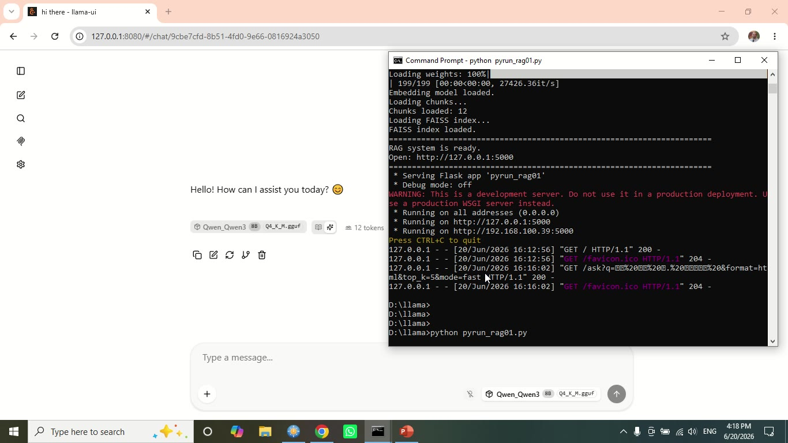

# Arabic Novel RAG Assistant - حكايات التاروت

A local **Retrieval-Augmented Generation (RAG)** experiment for teaching a local LLM how to answer detailed questions about an Arabic novel: **"حكايات التاروت" by Ahmed Khaled Tawfik**.

The goal is to prove that a local LLM can answer questions about private or custom Arabic text **without fine-tuning the model weights**. Instead of training the model, the system retrieves the most relevant parts of the novel and sends them to the model at question time.

> Important: The novel text is included in this ZIP because it was supplied as part of the experiment. If you publish this repository publicly, make sure you have the right to share the text file and demo video. For public GitHub sharing, you may remove `data/arabic_document01.txt` and keep only the code and documentation.

---

## Project Idea

Normal online LLMs or a regular local LLM may fail to answer specific questions about a novel if the novel is not inside the model training data, the model has no access to the full text, or the question asks about small events, characters, or details. This project solves that problem using RAG.

Instead of asking the model from memory, the system first searches inside the Arabic document, retrieves the closest passages, then asks the local model to answer **only from those retrieved passages**.

---

## What is RAG?

**RAG = Retrieval-Augmented Generation**.

It combines two parts:

1. **Retrieval**: search inside your own data and find the most relevant text passages.
2. **Generation**: send those passages to the LLM so it can generate a grounded answer.

In this project, RAG works as follows:

```text
Arabic novel text file
        ↓
Clean and split the text into chunks
        ↓
Convert each chunk into an embedding vector
        ↓
Store the vectors in a FAISS index
        ↓
User asks a question
        ↓
Convert the question into an embedding vector
        ↓
FAISS retrieves the closest chunks
        ↓
Send question + retrieved chunks to local Qwen3-8B
        ↓
Return an Arabic answer through Flask as HTML or JSON
```

---

## Why RAG instead of Fine-Tuning?

Fine-tuning changes model behavior by training on many examples. This is useful for teaching a repeated style, output format, classification task, or domain behavior.

For this project, the goal is different. The goal is to answer questions from a specific Arabic document. That is a **retrieval problem**, not a model-training problem.

| Technique | Changes model weights? | Best used for | Difficulty |
|---|---:|---|---:|
| Prompt / system instructions | No | style, role, language rules | Easy |
| RAG | No | books, novels, PDFs, private documents | Medium |
| Fine-tuning / LoRA | Yes | repeated behavior or task format | Advanced |

For Arabic novels, RAG is usually better because the system can keep the full text outside the model and retrieve only the useful passages for each question.

---

## Why this is important

This experiment demonstrates three important ideas:

1. **A local LLM can work with your own data.** You do not need to upload the novel to an online service.
2. **The model can answer questions that it could not answer normally.** The answer is grounded in the retrieved text, not only in the model's memory.
3. **LLMs are probabilistic systems.** The same question may produce two different correct answers or two different phrasings. This is normal because the model generates text probabilistically. The demo video shows this behavior. Lower temperature, stronger prompts, and better retrieval can reduce variation, but they do not completely remove it.

---

## Main Components

| File / Folder | Purpose |
|---|---|
| `build_document01_index.py` | Reads the Arabic document, chunks it, embeds chunks, and builds the FAISS index. |
| `pyrun_rag01.py` | Flask web interface and API for asking the local LLM using RAG. |
| `data/arabic_document01.txt` | Arabic document used as the RAG knowledge source. |
| `examples/questions.txt` | Test questions used for the Arabic novel. |
| `commands/run.txt` | Original run commands. |
| `docs/RAG_technical_notes_1.0.docx` | Full technical notes. |
| `media/Media1.mp4` | Demo video of the running experiment. |
| `media/demo_thumbnail.jpg` | Extracted thumbnail from the demo video. |
| `rag_index/` | Generated FAISS index and chunks will be stored here after running the index builder. |
| `models/` | Place your GGUF model here, for example Qwen3-8B Q4_K_M. |

---

## Technical Stack

- **Local LLM**: Qwen3-8B GGUF through `llama.cpp`
- **Server**: `llama-server.exe` with OpenAI-compatible chat endpoint
- **Backend**: Flask
- **Embeddings**: `sentence-transformers/paraphrase-multilingual-MiniLM-L12-v2`
- **Vector search**: FAISS
- **Answer language**: Arabic only
- **Interface language**: English HTML UI
- **Output formats**: HTML for browser, JSON for mobile/Flutter integration

---

## Folder Setup Expected by the Original Scripts

The original scripts use fixed Windows paths under:

```text
D:\llama
```

Recommended folder structure:

```text
D:\llama\
│
├── build_document01_index.py
├── pyrun_rag01.py
├── profile01.txt
│
├── data\
│   └── arabic_document01.txt
│
├── rag_index\
│   ├── chunks01.json        ← generated after indexing
│   └── faiss01.index        ← generated after indexing
│
└── models\
    └── Qwen_Qwen3-8B-Q4_K_M.gguf
```

If you unzip this repo somewhere else, either copy the files into `D:\llama` or edit the path constants at the top of the Python files.

---

## Installation

```bat
cd D:\llama
python -m venv .venv
.venv\Scripts\activate
pip install -r requirements.txt
```

Or install manually:

```bat
pip install flask requests sentence-transformers faiss-cpu numpy
```

---

## Step 1 - Build the RAG Index

```bat
cd D:\llama
python build_document01_index.py
```

Expected output:

```text
Reading Arabic document...
Paragraphs: ...
Chunks: ...
Loading embedding model...
Encoding chunks...
Building FAISS index...
Saving files...
Done.
```

This creates:

```text
D:\llama\rag_index\chunks01.json
D:\llama\rag_index\faiss01.index
```

---

## Step 2 - Start the Local LLM Server

```bat
cd D:\llama
llama-server.exe -m "D:\llama\models\Qwen_Qwen3-8B-Q4_K_M.gguf" --host 127.0.0.1 --port 8080 --ctx-size 4096 --threads 8 --n-gpu-layers all --reasoning off
```

Notes:

- `--n-gpu-layers all` forces available layers to GPU when supported.
- `--reasoning off` helps avoid hidden reasoning output and may make answers more direct.
- Keep this CMD window open.

---

## Step 3 - Start the Flask RAG Interface

Open a second CMD window:

```bat
cd D:\llama
python pyrun_rag01.py
```

Then open:

```text
http://127.0.0.1:5000
```

You can also access it from another device on the same network using your PC IP:

```text
http://YOUR_LOCAL_IP:5000
```

---

## Browser Example

```text
http://127.0.0.1:5000/ask?q=من هو د. رفعت؟&format=html&top_k=5&mode=fast
```

## JSON / Flutter Example

```text
http://127.0.0.1:5000/ask?q=من هو د. رفعت؟&format=json&top_k=5&mode=fast
```

The JSON endpoint returns the answer, retrieved passage previews, model information, and token speed statistics.

---

## Sample Questions

```text
من هو لوسيفر؟
من هو د. رفعت؟
أذكر أهم شخصيات القصة؟
ما الذي قاله د. لوسيفر عن الصور التي تم التقاطها لهذين الشابين؟
ما الذي قاله د. لوسيفر عن طبيعة هذين الشابين؟
```

More examples are available in `examples/questions.txt`.

---

## How the Flask RAG Wrapper Works

The Flask app performs the following actions for every question:

1. Reads the question from `/ask?q=...`.
2. Converts the question into an embedding.
3. Searches the FAISS index for the closest document chunks.
4. Builds a prompt containing the user profile, Arabic-answer rules, retrieved passages, and user question.
5. Sends the prompt to the local Qwen model through `llama-server`.
6. If the answer is mostly English, it calls the model again to rewrite the same answer in Arabic.
7. Returns the result as HTML or JSON.

---

## Important RAG Parameters

| Parameter | Meaning |
|---|---|
| `top_k` | Number of retrieved passages sent to the LLM. Default is 5. |
| `mode=fast` | Short answer, fewer tokens. |
| `mode=normal` | Medium answer. |
| `mode=detailed` | Longer answer. |
| `temperature=0.1` | Low randomness, more stable answers. |
| `MAX_TOP_K=10` | Safety limit to avoid sending too much context. |

---

## Limitations

- RAG does not permanently teach the model. The knowledge remains in the document and FAISS index.
- If OCR quality is poor, retrieval quality may be poor.
- If the retrieved passages are not relevant, the answer may be incomplete or wrong.
- Very long retrieved chunks may exceed context limits.
- LLMs may give different but still valid answers to the same question.
- For public repositories, verify copyright before uploading the source novel text.

---

## Suggested Improvements

- Add passage citations directly in the answer.
- Add a retrieval debug page to show the full retrieved passages.
- Store previous questions and answers in a local SQLite database.
- Add a Streamlit or Gradio interface.
- Add Docker support.
- Add evaluation metrics for retrieval quality.
- Try Arabic-specialized embedding models and compare results.
- Add a switch between regular local LLM answer and RAG-grounded answer to show the improvement.

---

## Demo

The demo video is included here:

```text
media/Media1.mp4
```

Thumbnail:



---

## Author Notes

This is a practical proof-of-concept showing how to connect:

```text
Arabic document + embeddings + FAISS + Flask + llama.cpp + local Qwen model
```

to build a local Arabic question-answering system over a private/custom document.
